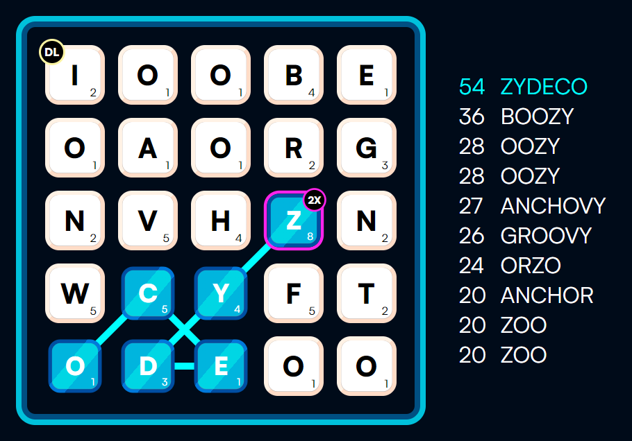

<p align="center" style="text-align: center">
  <a href="https://github.com/LukenSkyne/Svelte-Caster">
    
  </a>
</p>

<h3 align="center">SvelteCaster</h3>
<p align="center">
    the trusted source to flex vocabulary on your friends
</p>

<div align="center">

<a href="https://github.com/LukenSkyne/Svelte-Caster/blob/main/LICENSE"></a>

</div>

## About

Sometimes I really want to know what other words would've been possible.
This app uses a slightly transformed version of [aspell.net](http://app.aspell.net/create?max_size=70&spelling=US&max_variant=0&diacritic=strip&download=wordlist&encoding=utf-8&format=inline)'s dictionary for english words.
I'm still finding invalid words occasionally, so if you know the exact dictionary the Game uses, please consider opening an issue!

## Gallery

The following screenshot shows what the App looks like after entering all letters and the modifiers.
It's intended to look very closely to the original game, I hope you like it!



## Developing / Running the app

Once you've installed dependencies with `npm install` (or `pnpm install` or `yarn`), you can start a development server:

```bash
npm run dev

# or start the server and open the app in a new browser tab
npm run dev -- --open
```

You can enter letters by clicking into a cell.
By entering 1, you set the current cell to a 2X modifier.
Entering 2 or 3 sets the cell to either a double or triple letter multiplier.
